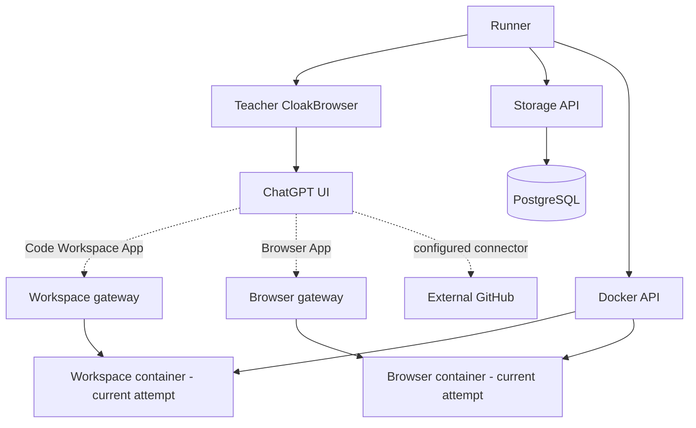
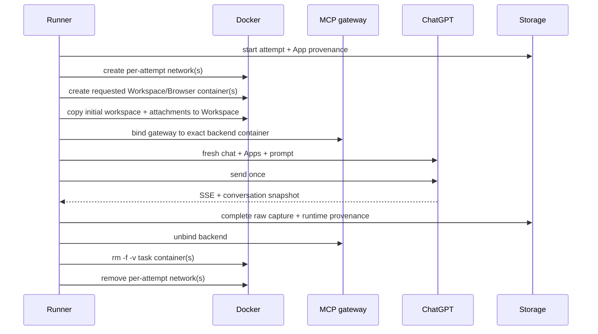

# Architecture

Qwen-compatible function calling is the canonical representation. ChatGPT is the teacher runtime. A ChatGPT App is only a deployment grouping around canonical tools.

The gateways are stable MCP endpoints. They contain no benchmark workspace, browser profile, cookies, downloads or task files. The runner creates and destroys the execution containers.

## Identity layers

| Layer | Stable identity | Mutable/runtime data |
|---|---|---|
| Benchmark | logical `app_id` | optional legacy name selector |
| Canonical tool | `(app_id, tool_name)` | none |
| Contract | semantic version + canonical manifest SHA-256 | none |
| ChatGPT UI | resolved visible App name | configurable |
| MCP deployment | gateway endpoint | transport concern |
| Attempt runtime | task + attempt + fingerprint + environment ID | container/image/network IDs |

## Attempt lifecycle

A task requesting only GitHub creates no local execution container. Workspace-only and Browser-only tasks create exactly one corresponding container.

## Initial workspace

`tasks/<task_id>/initial_workspace/` is only a host-side source tree read by the runner. It is never mounted into the execution container. Before the Workspace backend is exposed through the gateway, the runner copies that tree into `/workspace`. Attachments are copied separately under `/workspace/attachments/`.

The initial workspace hash participates in the task fingerprint. Symlinks and special files are rejected.

## Recovery

The journal phases remain `starting`, `apps_prepared`, `composer_dirty`, `submission_started`, `conversation_known`, and `cleanup_pending`. Environment IDs and container names are deterministic from task identity, attempt and fingerprint.

- Before `submission_started`, partial local runtimes may be destroyed and the attempt failed.
- At or after `submission_started`, the exact containers are preserved for recovery.
- Recovery discovers the existing containers and validates labels, networks, image identity and environment identity.
- If an expected container or network is missing, recovery fails instead of creating a replacement.
- Terminal cleanup destroys containers with volumes and removes attempt networks.

No recovered conversation is ever paired with a fresh workspace or browser profile.

## Networks

| Network | Members | Internet | Lifetime |
|---|---|---|---|
| `core_internal` | PostgreSQL, storage, teacher browser, runner | No | persistent |
| `ui_egress` | teacher browser | Yes | persistent |
| `app_control` | runner + stable gateways | No | persistent |
| `gpt-trace-task-<id>` | requested backend container(s) + corresponding gateways | No | one attempt |
| `gpt-trace-egress-<id>` | Browser backend only | Yes | one attempt |

Workspace has no internet route. Browser receives a separate, non-internal egress network for its attempt. Both per-attempt networks are deleted during cleanup.

## Docker ownership

Only the runner receives `/var/run/docker.sock`. Workspace containers, Browser containers and gateways never receive the socket. The model sees only canonical MCP tools, not Docker operations.

## Qwen flattening

App boundaries are removed during dataset transformation. Unique canonical tool names stay unchanged. Collisions are deterministically namespaced in the Qwen view while provenance preserves `(app_id, tool_name, manifest_sha256)`. UI labels and Docker names never become canonical model tool names.

## Stored evidence

Storage keeps raw captured messages plus exact App manifests/hashes, resolved UI names, environment IDs, initial workspace hash and per-attempt Docker provenance such as container ID, image reference and resolved image ID.
