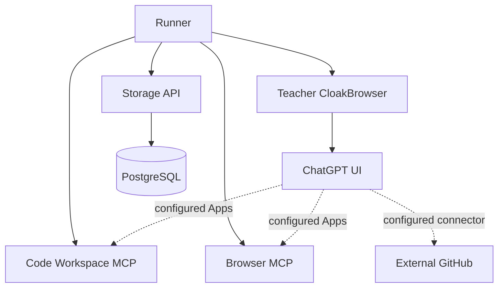
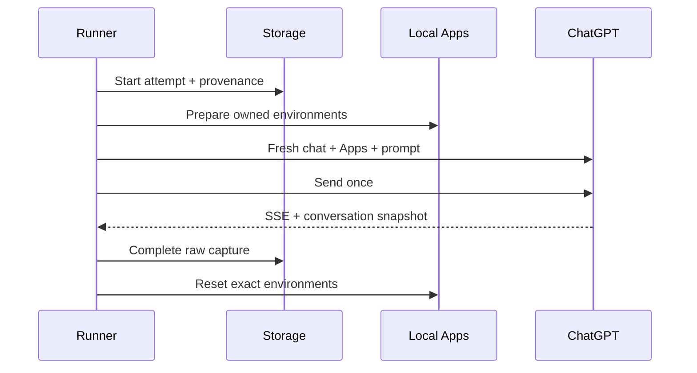

# Architecture

Qwen-compatible function calling is the canonical representation. ChatGPT is the teacher runtime, and a ChatGPT App is a deployment grouping that makes one or more canonical tools available during capture.

The dotted edges are ChatGPT account/deployment configuration, not Docker network links. Local MCP endpoints require an authenticated HTTPS gateway reachable by ChatGPT. Compose itself binds them only to host loopback.

## Identity layers

| Layer | Stable identity | Mutable/runtime data |
|---|---|---|
| Benchmark | logical `app_id` | optional legacy name selector |
| Canonical tool | `(app_id, tool_name)` | none |
| Contract | semantic version + canonical manifest SHA-256 | none |
| ChatGPT UI | resolved visible App name | may change through configuration |
| MCP deployment | endpoint/container | transport concern |
| Task environment | deterministic environment ID | owned profile/workspace state |

The registry resolves a logical ID only after loading and validating its exact manifest. Manifest bytes are canonical JSON: UTF-8, sorted object keys, no insignificant whitespace. The hash therefore changes for a tool name, description, argument schema, required field, or version change.

## Task sequence

The runner persists a journal before each irreversible boundary. Its phases are `starting`, `apps_prepared`, `composer_dirty`, `submission_started`, `conversation_known`, and `cleanup_pending`.

- Before `submission_started`, recovery may reset state and fail the interrupted attempt.
- At or after `submission_started`, the exact environment is preserved because a conversation may depend on it.
- Recovery verifies stored contract provenance and asserts the exact local environment before reading the known or uniquely evidenced conversation.
- After storage completion, `cleanup_pending` remains until every local App acknowledges an identity-matched reset.

No recovered conversation is paired with a fresh workspace or browser profile.

## Qwen flattening

An App boundary is removed during dataset transformation. Unique tool names stay unchanged. If multiple Apps expose the same canonical tool name, every colliding function is deterministically named `<normalized_app_id>__<tool_name>` in the flattened Qwen view. The export keeps an identity map back to `(app_id, tool_name, manifest_sha256)`.

Transport-generated names, OpenAI connector identifiers, and UI labels never become canonical Qwen names.

## Network and state boundaries

| Network | Members | Internet |
|---|---|---|
| `core_internal` | PostgreSQL, storage, teacher browser, runner | No |
| `ui_egress` | teacher browser | Yes |
| `code_control` | runner, Code Workspace | No |
| `browser_control` | runner, Browser App | No |
| `browser_egress` | Browser App | Yes |

The Code Workspace has no Docker socket, host mount, database credential, teacher profile, or egress network. The Browser App has a dedicated CloakBrowser process and profile volume and shares neither network nor volume with the teacher browser. The runner is the only multi-homed control participant; it exposes no listening service.

## Stored evidence

Storage keeps raw captured messages unchanged alongside:

- logical Apps available to the trajectory;
- exact versions, manifests and manifest hashes;
- runtime-resolved UI names;
- deterministic local environment IDs;
- requested/required Apps and observed invocation metadata;
- model, stream, browser-environment and capture metadata.

Source-dataset adapters for Codex, SWE-agent, ExploitBench, OpenHands or other agents belong in a later transformation layer. Equivalent observed operations may map to `code-workspace/exec_command`; they do not require duplicate runtime Apps.
